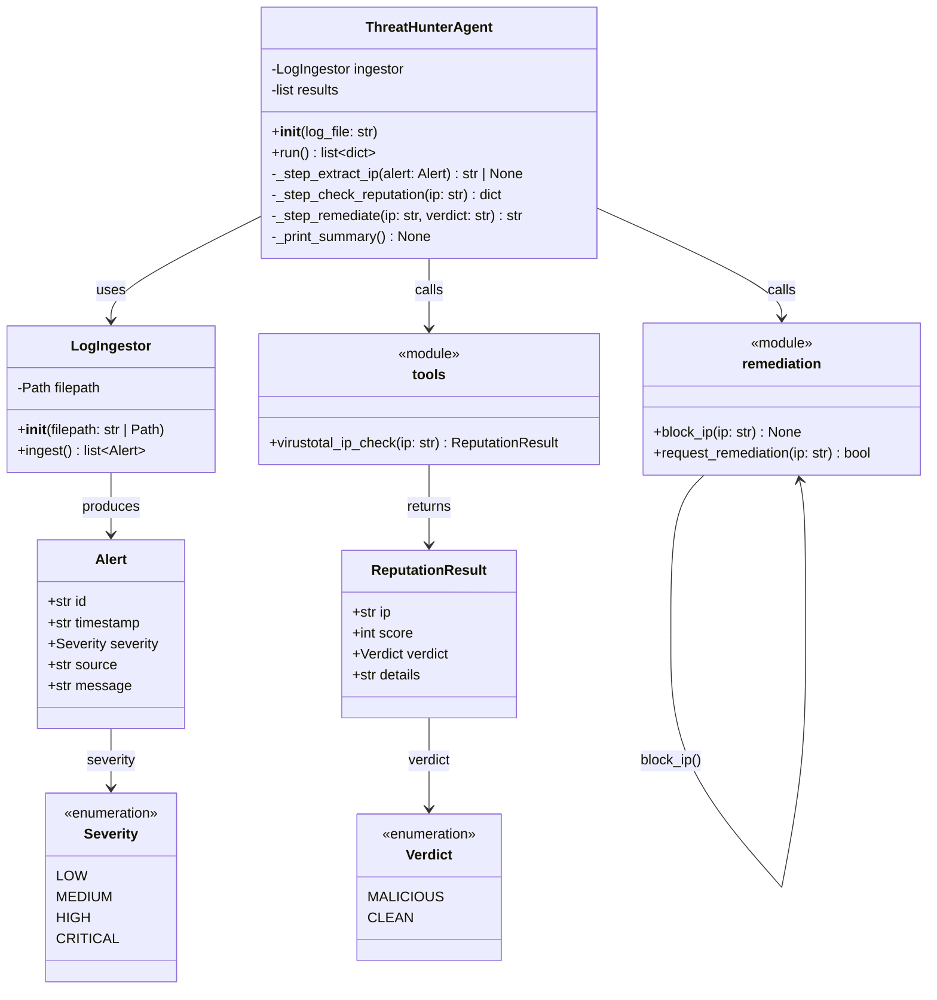

# C4 Model — Level 4: Code Diagram

Class-level view of all Python modules and their relationships.



## Module Dependency Graph

```
main.py
  └── threat_hunter/
        ├── agent.py
        │     ├── log_ingestor.py
        │     │     └── models.py (Alert)
        │     ├── tools.py
        │     │     └── models.py (ReputationResult, Verdict)
        │     ├── remediation.py
        │     └── models.py (Alert, Verdict)
        └── models.py (shared Pydantic models)
```
