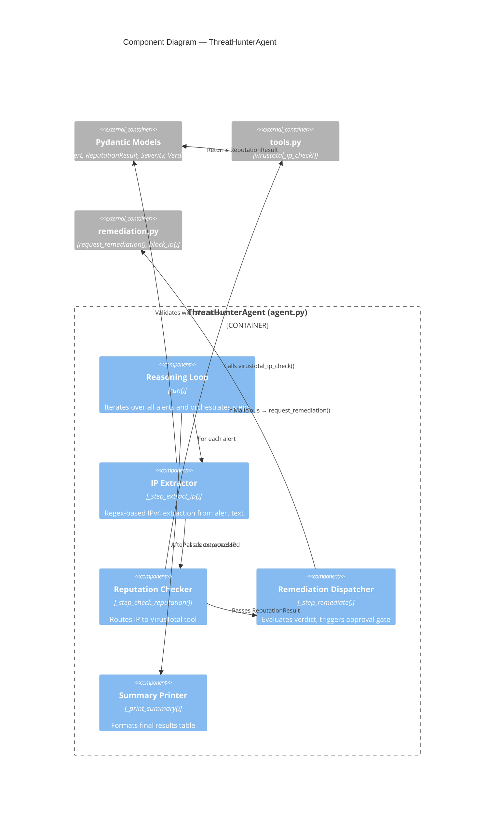
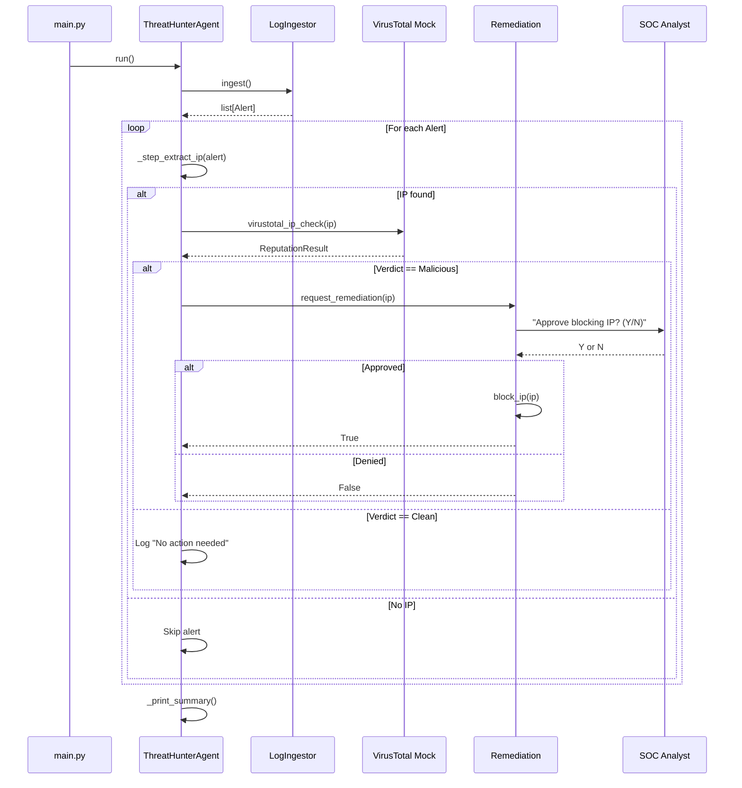

# C4 Model — Level 3: Component Diagram

Zooms into the ThreatHunterAgent container to show internal components and interactions.

```mermaid
C4Component
    title Component Diagram — ThreatHunterAgent

    Container_Boundary(agent, "ThreatHunterAgent (agent.py)") {
        Component(loop, "Reasoning Loop", "run()", "Iterates over all alerts and orchestrates steps")
        Component(extract, "IP Extractor", "_step_extract_ip()", "Regex-based IPv4 extraction from alert text")
        Component(decide, "Reputation Checker", "_step_check_reputation()", "Routes IP to VirusTotal tool")
        Component(act, "Remediation Dispatcher", "_step_remediate()", "Evaluates verdict, triggers approval gate")
        Component(summary, "Summary Printer", "_print_summary()", "Formats final results table")
    }

    Container_Ext(models, "Pydantic Models", "Alert, ReputationResult, Severity, Verdict")
    Container_Ext(tools, "tools.py", "virustotal_ip_check()")
    Container_Ext(remed, "remediation.py", "request_remediation(), block_ip()")

    Rel(loop, extract, "For each alert")
    Rel(extract, decide, "Passes extracted IP")
    Rel(decide, tools, "Calls virustotal_ip_check()")
    Rel(decide, act, "Passes ReputationResult")
    Rel(act, remed, "If Malicious → request_remediation()")
    Rel(loop, summary, "After all alerts processed")
    Rel(extract, models, "Validates with Alert model")
    Rel(tools, models, "Returns ReputationResult")
```

## Reasoning Loop Sequence

```mermaid
sequenceDiagram
    participant Main as main.py
    participant Agent as ThreatHunterAgent
    participant Ingestor as LogIngestor
    participant VT as VirusTotal Mock
    participant Remed as Remediation
    participant Analyst as SOC Analyst

    Main->>Agent: run()
    Agent->>Ingestor: ingest()
    Ingestor-->>Agent: list[Alert]

    loop For each Alert
        Agent->>Agent: _step_extract_ip(alert)
        alt IP found
            Agent->>VT: virustotal_ip_check(ip)
            VT-->>Agent: ReputationResult
            alt Verdict == Malicious
                Agent->>Remed: request_remediation(ip)
                Remed->>Analyst: "Approve blocking IP? (Y/N)"
                Analyst-->>Remed: Y or N
                alt Approved
                    Remed->>Remed: block_ip(ip)
                    Remed-->>Agent: True
                else Denied
                    Remed-->>Agent: False
                end
            else Verdict == Clean
                Agent->>Agent: Log "No action needed"
            end
        else No IP
            Agent->>Agent: Skip alert
        end
    end

    Agent->>Agent: _print_summary()
```
