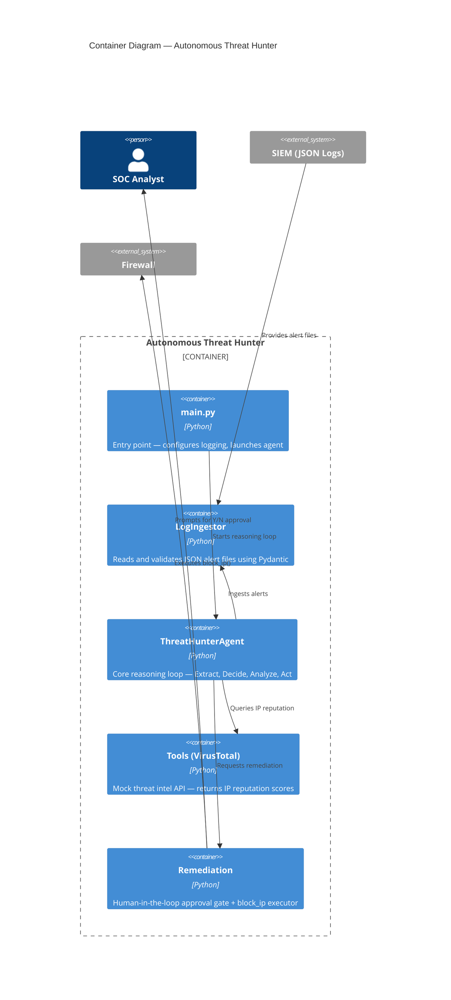

# C4 Model — Level 2: Container Diagram

Shows the internal containers (processes, modules) of the Threat Hunter system.

## Container Responsibilities

| Container | Input | Output | Key Constraint |
|-----------|-------|--------|----------------|
| LogIngestor | JSON file path | `list[Alert]` | Skips malformed entries, never crashes |
| ThreatHunterAgent | Alert list | Summary results | Sequential per-alert reasoning |
| VirusTotal Tool | IP string | `ReputationResult` | Deterministic mock — no network I/O |
| Remediation | IP + verdict | Block/Skip action | **Must** get human approval first |
