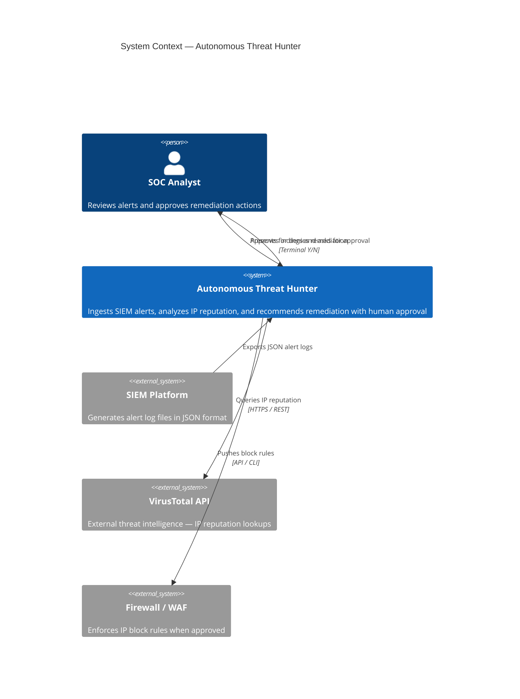

# C4 Model — Level 1: System Context Diagram

Shows how the Autonomous Threat Hunter fits into the broader SOC ecosystem.

## Data Flow Summary

| Flow | Source | Destination | Protocol | Latency Req |
|------|--------|-------------|----------|-------------|
| Alert ingestion | SIEM | Threat Hunter | File read (JSON) | Batch — seconds |
| IP reputation | Threat Hunter | VirusTotal | HTTPS REST | < 2s per query |
| Approval prompt | Threat Hunter | SOC Analyst | Terminal I/O | Human-speed |
| IP block | Threat Hunter | Firewall | API/CLI | < 1s |
